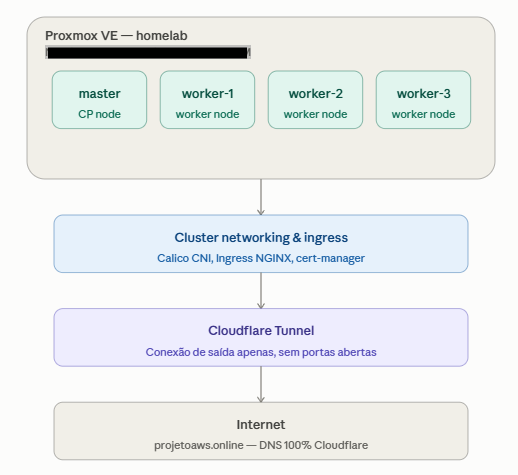
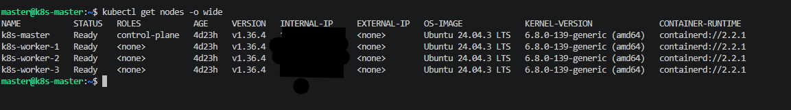
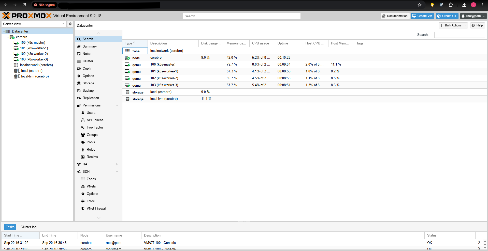
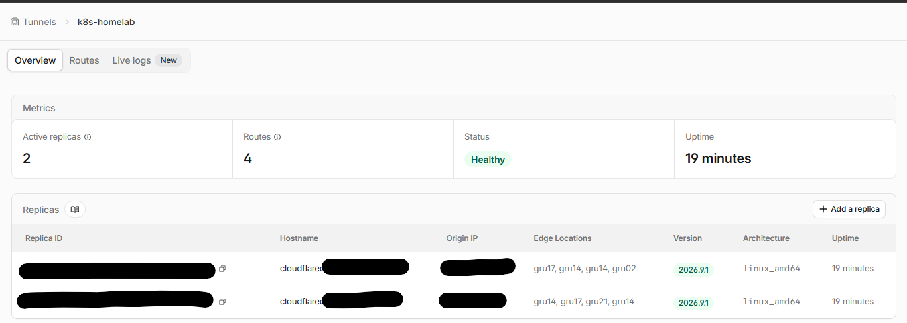
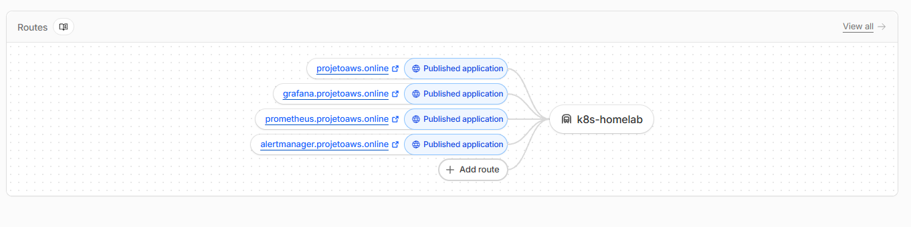
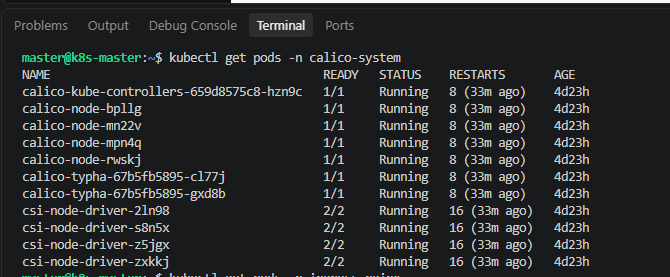
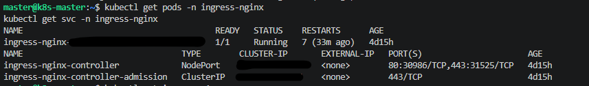
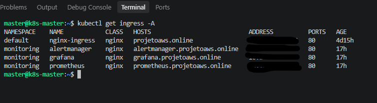

# Homelab Kubernetes — Infraestrutura Base

Este repositório documenta laboratórios práticos de Kubernetes/observabilidade/
autoscaling. Todos rodam sobre a infraestrutura descrita aqui: um cluster
Kubernetes bare-metal (kubeadm) hospedado em um homelab pessoal via Proxmox,
exposto publicamente através de Cloudflare Tunnel.

## 🎯 Objetivo

Prover uma base de cluster Kubernetes "puro" (sem cloud managed), com CNI,
Ingress, TLS e exposição segura, resolvendo o desafio de rede residencial
com CGNAT — servindo como fundação para os demais laboratórios deste repositório.

## Arquitetura

## Infraestrutura

- Hypervisor: **Proxmox VE**, rodando em computador gamer (i7, 32GB RAM)
- Cluster: **kubeadm** (Kubernetes "puro"), 1 master + 3 workers
- CNI: **Calico** via Tigera Operator
- Ingress: **Ingress NGINX** (via Helm)
- TLS: **cert-manager** com desafio DNS-01
- Exposição externa: **Cloudflare Tunnel**, contornando CGNAT da rede residencial
- DNS: domínio `projetoaws.online`, nameservers 100% na Cloudflare

## Desafios Resolvidos

- Rede residencial (Vivo) com CGNAT impedindo port-forward tradicional →
  resolvido via Cloudflare Tunnel (saída, não entrada de conexão)
- Necessidade de zona DNS 100% Cloudflare para publicação automática de
  registros do túnel → domínio de testes dedicado (`projetoaws.online`)

## 📷 Evidências

| Componente                    | Screenshot                              |
|---------------------------------|------------------------------------------|
| Nodes do cluster `Ready`        |  |
| Proxmox — VMs do cluster        |    |
| Cloudflare Tunnel `Healthy`     |  |
| DNS/rotas publicadas            |   |
| Calico rodando em todos os nodes |  |
| Ingress NGINX Controller ativo |  |
| Ingress roteando por hostname |  |

## Laboratórios que rodam sobre esta infraestrutura

- [`01-kube-prometheus-eks`](../01-kube-prometheus-eks) 
- [`02-servicemonitors-podmonitors-alertas`](../02-servicemonitors-podmonitors-alertas)
- [`03-autoscaling-hpa-metrics-server`](../03-autoscaling-hpa-metrics-server)
