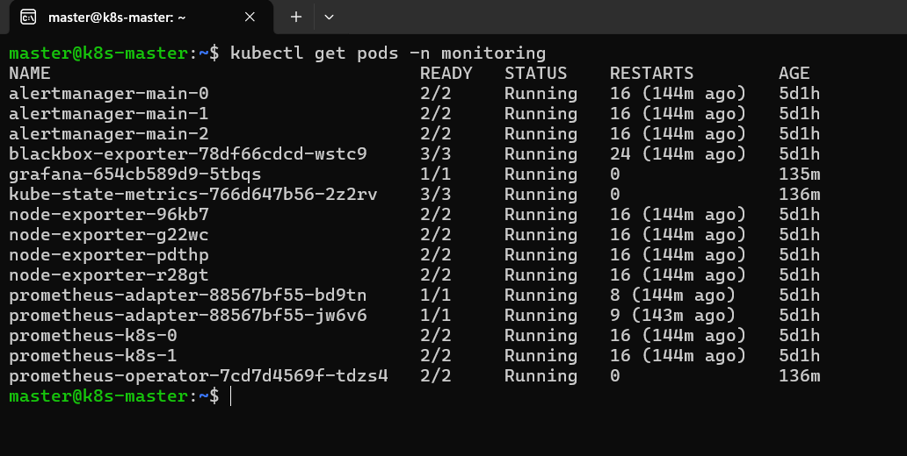
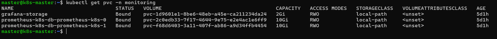
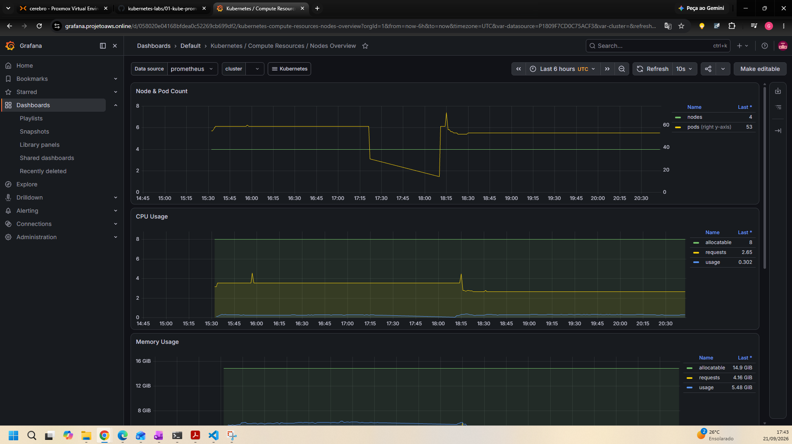
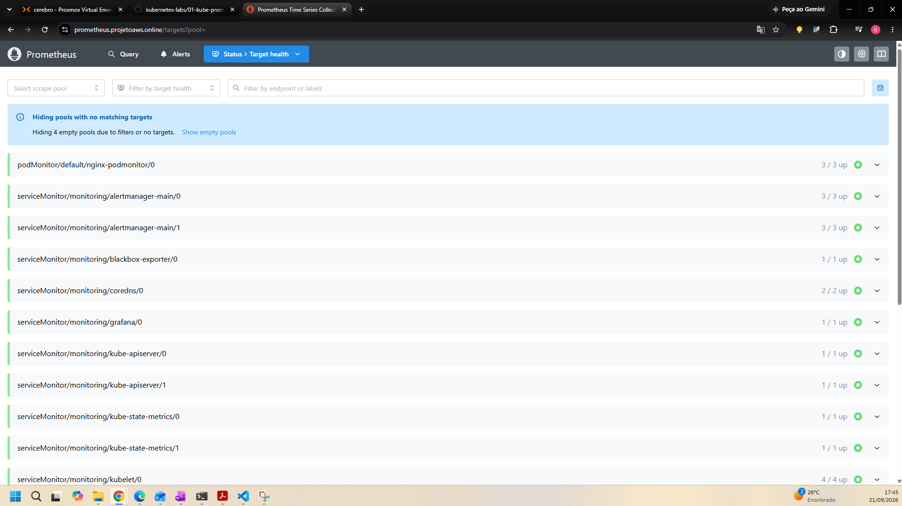

# Observabilidade com Kube-Prometheus no Amazon EKS

Laboratório de implantação da stack de observabilidade (Prometheus Operator, Grafana e
Alertmanager) em um cluster Amazon EKS, desde a instalação via manifests até a exposição
segura dos dashboards para acesso externo.

## Objetivo

Subir uma stack de monitoramento pronta para produção no EKS usando o projeto
`kube-prometheus`, validando a descoberta de métricas via CRDs, garantindo persistência
de dados e resolvendo os problemas de recurso que apareceram no caminho.

## Arquitetura

## O que foi feito

- Provisionamento dos CRDs (`manifests/setup/`), com verificação via `kubectl wait --for condition=Established`
- Instalação da stack completa: Prometheus Operator, Grafana, Alertmanager, node-exporter, kube-state-metrics, prometheus-adapter e blackbox-exporter
- O Grafana começou a cair com `OOMKilled` — diagnosticado e resolvido ajustando os `resources.limits`
- Persistência configurada via `StorageClass` (`local-path-provisioner`), com `PersistentVolumeClaim` tanto no Prometheus (via `storage.volumeClaimTemplate` no CR) quanto no Grafana
- Exposição externa via Ingress NGINX + Cloudflare Tunnel, para contornar o CGNAT da rede
- Ajuste de `NetworkPolicy` liberando o tráfego do Ingress Controller até os componentes da stack

## Resultado

A stack ficou de pé e persistente — restart de Pod ou reboot de nó não derruba dados nem
configuração. Dashboards e métricas acessíveis externamente, com segurança.

## Evidências

| Componente                     | Screenshot                              |
|---------------------------------|------------------------------------------|
| Pods da stack `Running`         |   |
| PVCs `Bound`                     |          |
| Grafana acessível externamente  |   |
| Prometheus Targets               |  |